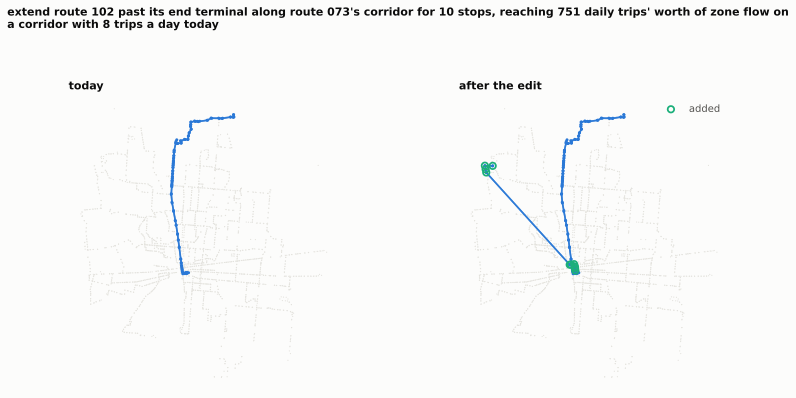
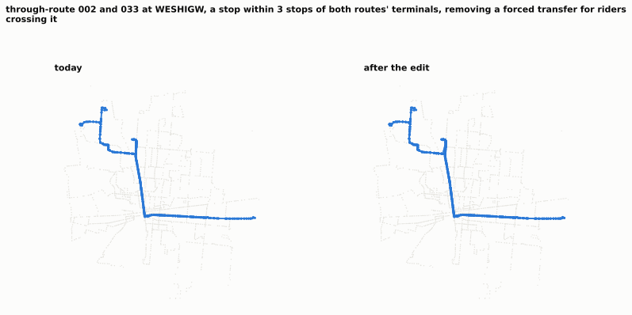
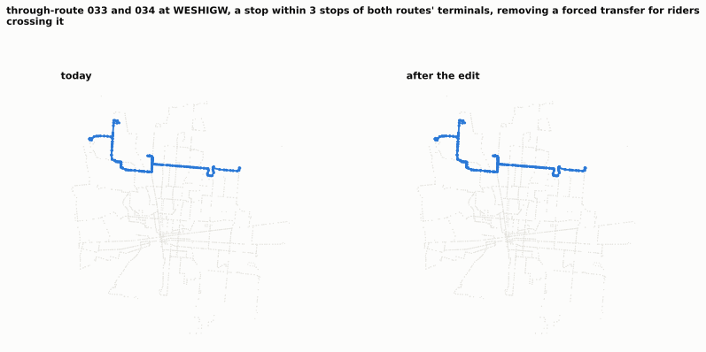
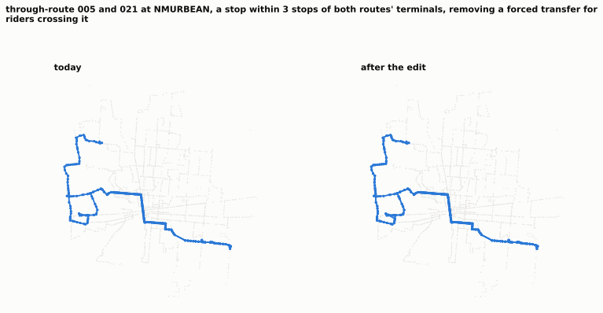
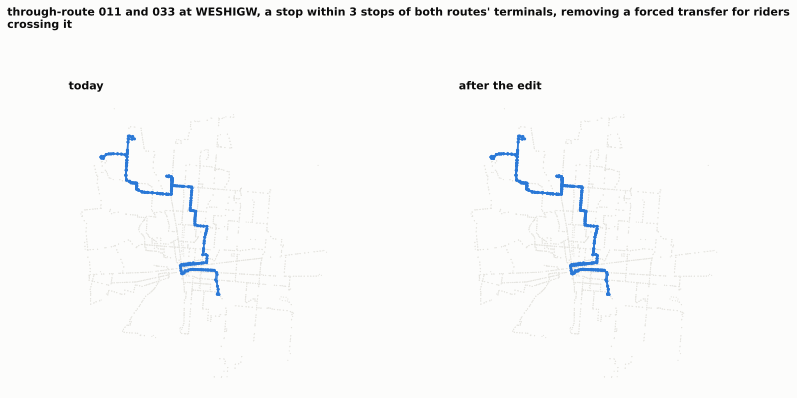
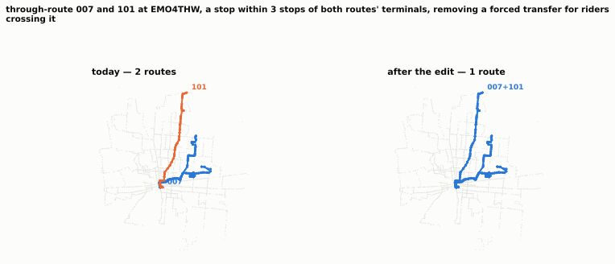

# Strongest geometry candidates, inspected

Screening rank got these here. Whether they survive is a question about what they actually do, which is what this file is for. Everything below is pre-fixpoint and exploratory.

## 1. extend route 102 past its end terminal along route 073's corridor for 10 stops, reaching 751 daily trips' worth of zone flow on a corridor with 8 trips a day today

- **id** `extend|102|a10:BLARINN1` · **kind** extend · **routes** 102
- **evidence** primary, 1.5% of segments priced by the running-time model (2 of 135)
- **supply** -36.2 vehicle-hours at baseline (74.0 → 102.9 min per pattern, +39.1%); headways then rescaled ×1.0144 to spend the budget back
- **stops** −0 / +10; 0 would lose their only service; 6 affected stops are served by more than one route
- **demand reached** 5,530 gained, 0 lost (uniquely-served weight)
- **service today** mean headway 48.3 min across 6 route-periods, best 30.0 min
- **screen** cost +1.410%, unserved -16.619% (frequency not reallocated — a rank, not a measurement)
- **added**: N 4TH ST & E GAY ST (4THATHN), S 4TH ST & E CAPITAL ST (4THCAPN), S 4TH ST & E TOWN ST (4THTOWN), BLAZER PKWY & RINGS RD (BLARINN1), EMERALD PKWY & GLENDON CT (EMEGLEN), EMERALD PKWY & STERLING COMMERCE (EMESTEN), E SPRING ST & N 4TH ST (SPR4THW), W SPRING ST & N FRONT ST (SPRFROW) … and 2 more
- **planner would object**: nan

## 2. through-route 002 and 033 at WESHIGW, a stop within 3 stops of both routes' terminals, removing a forced transfer for riders crossing it

- **id** `splice|002|033|WESHIGW` · **kind** splice · **routes** 002+033
- **evidence** primary, 0.7% of segments priced by the running-time model (2 of 292)
- **supply** -0.4 vehicle-hours at baseline (63.4 → 80.4 min per pattern, +26.7%); headways then rescaled ×1.0002 to spend the budget back
- **stops** −0 / +0; 0 would lose their only service; 0 affected stops are served by more than one route
- **demand reached** 0 gained, 0 lost (uniquely-served weight)
- **service today** mean headway 33.5 min across 12 route-periods, best 14.4 min
- **screen** cost +0.281%, unserved -0.172% (frequency not reallocated — a rank, not a measurement)
- **planner would object**: touches a top-10 route by vehicle-hours

## 3. through-route 033 and 034 at WESHIGW, a stop within 3 stops of both routes' terminals, removing a forced transfer for riders crossing it

- **id** `splice|033|034|WESHIGW` · **kind** splice · **routes** 033+034
- **evidence** primary, 0.0% of segments priced by the running-time model (0 of 192)
- **supply** -0.6 vehicle-hours at baseline (43.4 → 59.0 min per pattern, +35.9%); headways then rescaled ×1.0002 to spend the budget back
- **stops** −0 / +0; 0 would lose their only service; 0 affected stops are served by more than one route
- **demand reached** 0 gained, 0 lost (uniquely-served weight)
- **service today** mean headway 31.8 min across 12 route-periods, best 15.0 min
- **screen** cost -0.355%, unserved -0.120% (frequency not reallocated — a rank, not a measurement)
- **planner would object**: touches a top-10 route by vehicle-hours

## 4. through-route 005 and 021 at NMURBEAN, a stop within 3 stops of both routes' terminals, removing a forced transfer for riders crossing it

- **id** `splice|005|021|NMURBEAN` · **kind** splice · **routes** 005+021
- **evidence** primary, 0.6% of segments priced by the running-time model (2 of 334)
- **supply** +1.3 vehicle-hours at baseline (84.3 → 111.2 min per pattern, +31.9%); headways then rescaled ×0.9995 to spend the budget back
- **stops** −0 / +0; 0 would lose their only service; 0 affected stops are served by more than one route
- **demand reached** 0 gained, 0 lost (uniquely-served weight)
- **service today** mean headway 76.1 min across 12 route-periods, best 28.2 min
- **screen** cost +0.430%, unserved -0.092% (frequency not reallocated — a rank, not a measurement)
- **planner would object**: touches a top-10 route by vehicle-hours

## 5. through-route 011 and 033 at WESHIGW, a stop within 3 stops of both routes' terminals, removing a forced transfer for riders crossing it

- **id** `splice|011|033|WESHIGW` · **kind** splice · **routes** 011+033
- **evidence** primary, 0.7% of segments priced by the running-time model (2 of 278)
- **supply** -0.2 vehicle-hours at baseline (53.6 → 73.1 min per pattern, +36.5%); headways then rescaled ×1.0001 to spend the budget back
- **stops** −0 / +0; 0 would lose their only service; 0 affected stops are served by more than one route
- **demand reached** 0 gained, 0 lost (uniquely-served weight)
- **service today** mean headway 63.4 min across 12 route-periods, best 30.0 min
- **screen** cost +0.106%, unserved -0.069% (frequency not reallocated — a rank, not a measurement)
- **planner would object**: nan

## 6. through-route 007 and 101 at EMO4THW, a stop within 3 stops of both routes' terminals, removing a forced transfer for riders crossing it

- **id** `splice|007|101|EMO4THW` · **kind** splice · **routes** 007+101
- **evidence** primary, 0.0% of segments priced by the running-time model (0 of 216)
- **supply** +0.3 vehicle-hours at baseline (53.8 → 65.8 min per pattern, +22.3%); headways then rescaled ×0.9999 to spend the budget back
- **stops** −0 / +0; 0 would lose their only service; 0 affected stops are served by more than one route
- **demand reached** 0 gained, 0 lost (uniquely-served weight)
- **service today** mean headway 28.0 min across 12 route-periods, best 15.0 min
- **screen** cost +0.375%, unserved -0.052% (frequency not reallocated — a rank, not a measurement)
- **planner would object**: touches a top-10 route by vehicle-hours

