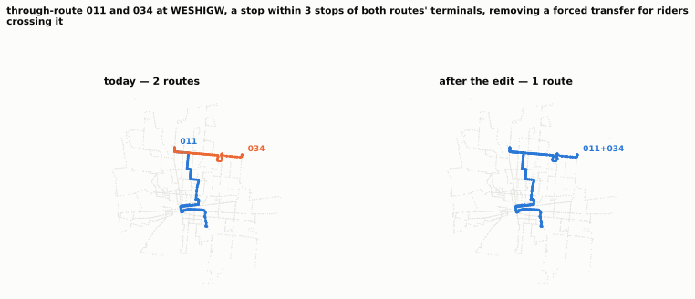
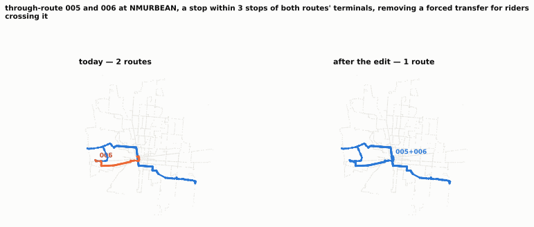

# Strongest geometry candidates, inspected

**Selected and ordered by measured performance**, from `exp2_eval_order_modelB.csv` — not by screen rank. D19 found the screen's first-ranked candidate of sixty to be the worst of the twelve on evaluation, so an inspection tier fed by screen rank inspects the wrong candidates. Effects quoted below the fold are the screen's and are kept only for comparison.

## 1. through-route 011 and 034 at WESHIGW, a stop within 3 stops of both routes' terminals, removing a forced transfer for riders crossing it

- **id** `splice|011|034|WESHIGW` · **kind** splice · **routes** 011+034
- **evidence** primary, 0.0% of segments priced by the running-time model (0 of 280)
- **supply** +1.0 vehicle-hours at baseline (61.2 → 91.5 min per pattern, +49.4%); headways then rescaled ×0.9996 to spend the budget back
- **stops** −0 / +0; 0 would lose their only service; 0 affected stops are served by more than one route
- **demand reached** 0 gained, 0 lost (uniquely-served weight)
- **service today** mean headway 53.2 min across 12 route-periods, best 15.0 min
- **screen** cost +0.149%, unserved -0.017% (frequency not reallocated — a rank, not a measurement)
- **planner would object**: touches a top-10 route by vehicle-hours

## 2. through-route 033 and 034 at WESHIGW, a stop within 3 stops of both routes' terminals, removing a forced transfer for riders crossing it

- **id** `splice|033|034|WESHIGW` · **kind** splice · **routes** 033+034
- **evidence** primary, 0.0% of segments priced by the running-time model (0 of 192)
- **supply** -0.6 vehicle-hours at baseline (43.4 → 59.0 min per pattern, +35.9%); headways then rescaled ×1.0002 to spend the budget back
- **stops** −0 / +0; 0 would lose their only service; 0 affected stops are served by more than one route
- **demand reached** 0 gained, 0 lost (uniquely-served weight)
- **service today** mean headway 31.8 min across 12 route-periods, best 15.0 min
- **screen** cost -0.355%, unserved -0.120% (frequency not reallocated — a rank, not a measurement)
- **planner would object**: touches a top-10 route by vehicle-hours

## 3. through-route 005 and 006 at NMURBEAN, a stop within 3 stops of both routes' terminals, removing a forced transfer for riders crossing it

- **id** `splice|005|006|NMURBEAN` · **kind** splice · **routes** 005+006
- **evidence** primary, 0.6% of segments priced by the running-time model (2 of 312)
- **supply** +0.6 vehicle-hours at baseline (77.0 → 100.2 min per pattern, +30.1%); headways then rescaled ×0.9998 to spend the budget back
- **stops** −0 / +0; 0 would lose their only service; 0 affected stops are served by more than one route
- **demand reached** 0 gained, 0 lost (uniquely-served weight)
- **service today** mean headway 44.7 min across 12 route-periods, best 14.4 min
- **screen** cost -0.374%, unserved +0.000% (frequency not reallocated — a rank, not a measurement)
- **planner would object**: touches a top-10 route by vehicle-hours

## 4. through-route 011 and 033 at WESHIGW, a stop within 3 stops of both routes' terminals, removing a forced transfer for riders crossing it

- **id** `splice|011|033|WESHIGW` · **kind** splice · **routes** 011+033
- **evidence** primary, 0.7% of segments priced by the running-time model (2 of 278)
- **supply** -0.2 vehicle-hours at baseline (53.6 → 73.1 min per pattern, +36.5%); headways then rescaled ×1.0001 to spend the budget back
- **stops** −0 / +0; 0 would lose their only service; 0 affected stops are served by more than one route
- **demand reached** 0 gained, 0 lost (uniquely-served weight)
- **service today** mean headway 63.4 min across 12 route-periods, best 30.0 min
- **screen** cost +0.106%, unserved -0.069% (frequency not reallocated — a rank, not a measurement)
- **planner would object**: nothing flagged

